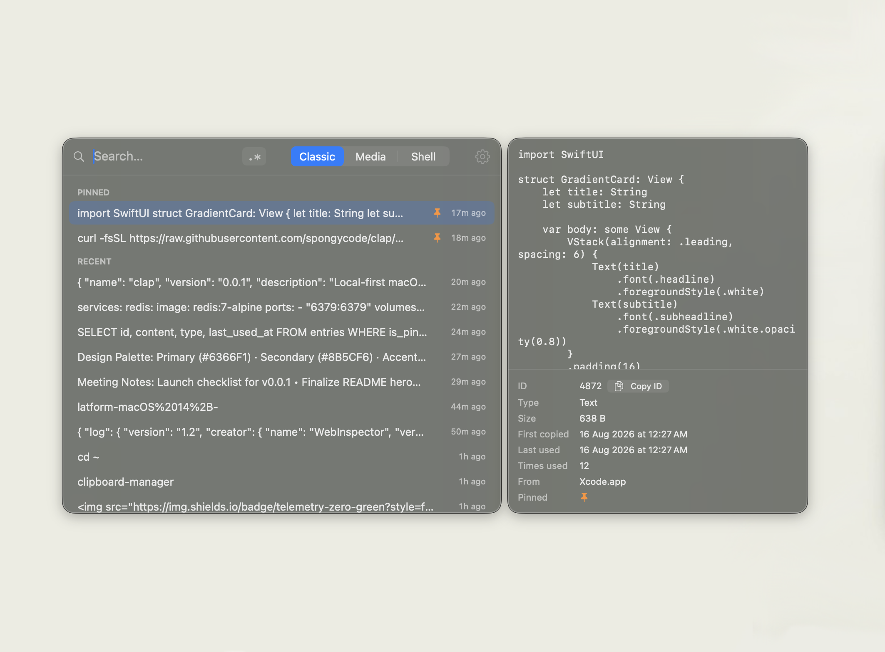
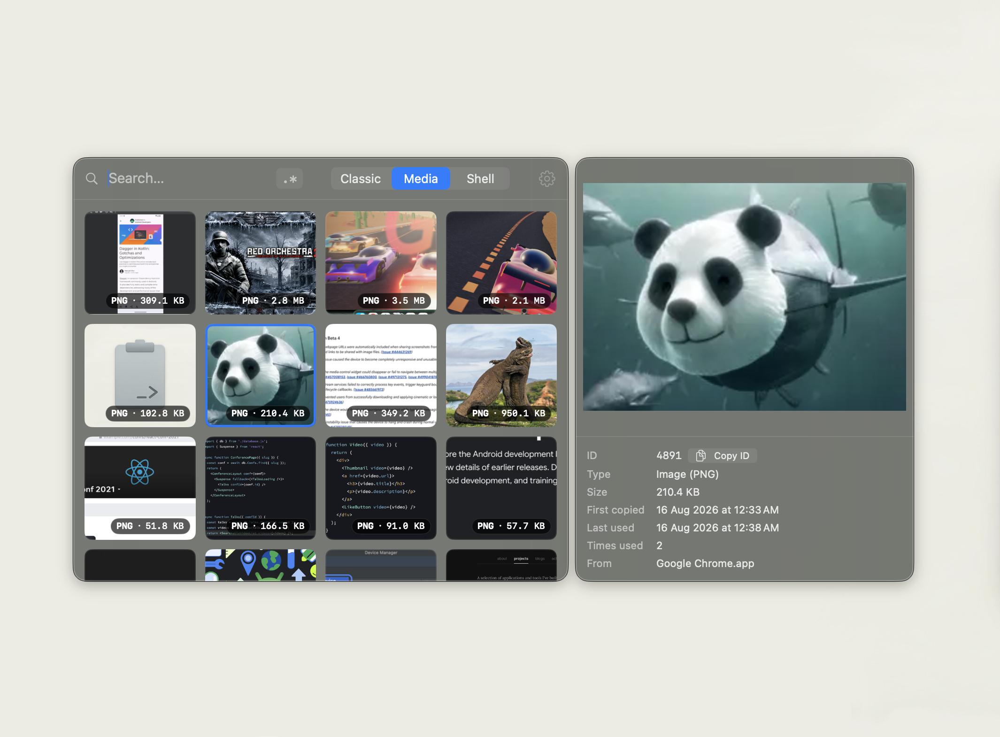
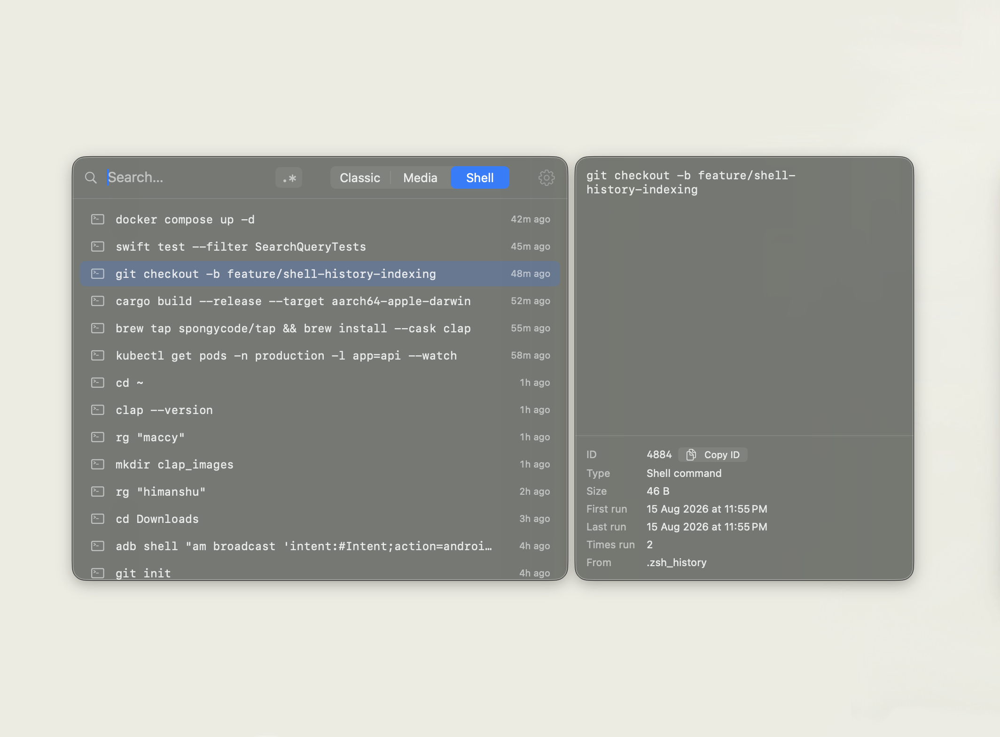
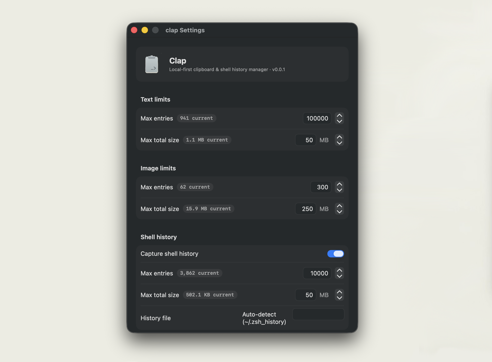

<p align="center">
  
</p>

<h1 align="center">clap</h1>

<p align="center">
  <strong>Native, high-performance, local-first macOS clipboard & shell history manager.</strong>
</p>

<p align="center">
  <a href="https://github.com/spongycode/clap/releases"></a>
  
  
  <a href="LICENSE"></a>
  
</p>

<br/>

- **Massive history** — 100,000 text entries, 500 images, and 50,000 shell commands by default with zero slowdown.
- **Instant** — Hash-indexed dedup, SQLite WAL + FTS5 search, virtualized SwiftUI list, thumbnail cache.
- **Keyboard-first & Fast** — `⌘⇧V` opens the panel; single click or `Enter` copies, closes, and pastes directly.
- **Permanent Favorites & Snippets** — Bookmark canned replies, email signatures, code snippets, and commands (`⌘S` / `⌘4`).
- **Quick Text Case Conversions** — Transform snippets into `camelCase`, `snake_case`, `kebab-case`, `PascalCase`, `UPPERCASE`, etc., on copy.
- **Smart Color Swatch Detection** — Recognizes `#hex`, `rgb()`, `rgba()`, `hsl()` color codes with live inline circle swatches.
- **Search Match Highlighting** — High-contrast match highlighting across list items and preview pane for terms, phrases, and regex.
- **Shell History Ingestion** — Automatically captures and indexes commands from `~/.zsh_history` and `~/.bash_history`.
- **Local-first & Private** — No network, no accounts, no telemetry, no analytics.
- **Full CLI** — `clap` controls everything from your terminal or shell scripts.

---

## Screenshots

<p align="center">
  
  
</p>

<p align="center">
  
  
</p>

---

## Installation

### Option 1: One-line install (Recommended)

Run in your terminal:

```bash
curl -fsSL https://raw.githubusercontent.com/spongycode/clap/main/install.sh | bash
```

This compiles release binaries, places `clap.app` in `/Applications/`, symlinks the `clap` CLI into your `$PATH`, and launches the app.

---

### Option 2: Homebrew

```bash
brew tap spongycode/tap
brew install --cask clap
```

---

### Option 3: Direct Download

Download the latest `clap-vX.X.X.zip` from [GitHub Releases](https://github.com/spongycode/clap/releases), unzip, and drag `clap.app` to `/Applications`.

---

### Option 4: Build from Source

Requires macOS 14+ and Xcode Command Line Tools (`xcode-select --install`):

```bash
git clone https://github.com/spongycode/clap.git
cd clap
./Scripts/make_app.sh
open dist/clap.app
ln -sf "$PWD/dist/bin/clap" /usr/local/bin/clap
```

For development & testing:

```bash
swift build          # Build ClapApp + clap CLI
swift test           # Run 90 unit tests
.build/debug/ClapApp # Run debug app directly
```

---

## Usage

Press **⌘⇧V** to open the panel (configurable in Settings to `⌘⇧B`, `⌘⇧C`, `⌥Space`, `⌘⇧Space`, `⌃⌥V`).

| Key / Action | Description |
| :--- | :--- |
| **Single Click** | Copy entry, close panel, and paste directly into active app |
| **↑ / ↓** | Navigate entries |
| **Enter** | Copy selected entry, close, and paste into active app |
| **⌘1 / ⌘2 / ⌘3 / ⌘4** | Switch tabs: **Classic (⌘1)** · **Media (⌘2)** · **Shell (⌘3)** · **Favs (⌘4)** |
| **⌘S** or **⌘B** | Toggle Favorite / Bookmark on selected entry (marked with ❤️) |
| **⌘P** | Pin / unpin selected entry (pinned items stick to top of Classic view) |
| **⌘F** | Focus search bar |
| **⌘D** or **⌥⌫** | Delete selected entry |
| **⌘R** | Toggle regex search mode (or click the `.*` button) |
| **Esc** | Close panel |

- **Hover Selection**: Hovering over any row selects it and opens a rich preview (full scrollable text/command, high-res image, color swatch card, and case conversion menu).
- **Copy As… Transformation**: Click "Copy as…" in the preview popup or right-click any text entry to transform case into `camelCase`, `snake_case`, `kebab-case`, etc.
- **Direct Paste**: Pastes straight into your frontmost application (requires Accessibility permission prompted on first launch).
- **Move & Resize**: Drag the panel background to reposition and drag edges to resize. Position and dimensions persist across restarts.

---

## Full CLI Reference

`clap` includes a standalone CLI that interacts with the store and running application:

```bash
clap                                              # Open clipboard UI
clap list [--images] [--shell] [--limit N]        # List recent clipboard or shell entries
clap search <query> [--type text|image|shell]     # Full-text search
clap search --regex "^docker.*"                   # Regex search
clap get <id>                                     # Show entry (pipe-friendly raw output)
clap copy <id>                                    # Copy entry to pasteboard
clap delete <id> | --text <str> | --regex <pat>   # Delete entries (alias: clap out)
clap pin <id> / clap unpin <id>                   # Pin/unpin entries
clap clear [--force]                              # Wipe history (preserves pinned)
clap stats [--json]                               # Storage and activity metrics
clap config get [key] / set <key> <val>           # Manage limits, retention, exclusions
clap doctor                                       # System diagnostic checks
clap import shell-history [--file <path>]         # Backfill shell history (zsh/bash)
clap import maccy [--db <path>]                   # Migrate history from Maccy
clap pause / clap resume                          # Toggle clipboard monitoring
```

---

## Data & Storage

- Storage Directory: `~/Library/Application Support/clap/` (`clap.sqlite`, `images/`, `thumbnails/`).
- Configurable via `CLAP_DATA_DIR` environment variable or `--data-dir <path>`.
- Default Limits: Text (100k entries / 50 MB), Image (500 entries / 100 MB), Shell (50k entries / 10 MB).
- Automatic LRU eviction and configurable retention policies (7 / 30 / 90 / 365 days / forever).

---

## Privacy

- Clipboard and shell commands never leave your Mac.
- Zero network requests, zero telemetry, zero analytics.
- Password managers and concealed clipboard types are automatically ignored.
- Exclude any app by bundle ID via Settings UI or `clap config set exclusions '["com.example.app"]'`.

---

## License

This project is licensed under the [MIT License](LICENSE).
